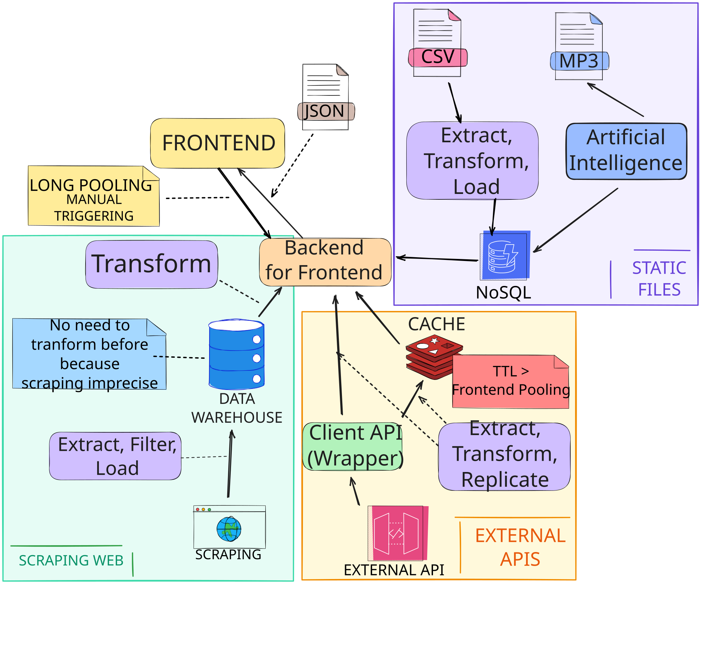

<!-- _paginate: skip -->

# _Joint OVNI Surveilance Environment_
Equipo 3
Datos Masivos y Encadenados 24/25  

_Máster en Ingeniería Informática  
Universidad Carlos III de Madrid_

---
## Índice
1. Resumen ejecutivo
2. Arquitectura
3. Fuentes de datos

---
## Resumen ejecutivo
- Página web para avistamiento de OVNIs
    - Mapa 3D del planeta
- Fuentes de datos heterogéneos
    - Multimedia
    - _Datasets_
    - Públicas y privadas
- IA para procesado

---

## Arquitectura

---
<!-- header: '**Arquitectura**' -->

### Extracción, procesado y almacenamiento de datos

#### _Web scraping_
- Agregados en _data warehouse_
- Procesados en consulta

#### APIs externas
- Wrapper específico por fuente
- Almacenado en caché

---

#### Datos estáticos
- Transformados y agregados en No-SQL
- Procesamiento por IA

 

### Visualizado de información
- Arquitectura _backend for frontend_
- _Long pooling_ y _manual triggering_
- REST API

---
<!-- header: '' -->

## Fuentes de datos principales

- Avistamientos (registros, multimedia): [UFO Stalker](https://ufostalker.com/ufo-sighting-list), [NUFORC](https://nuforc.org/databank/), [SETI](http://seti.berkeley.edu/opendata/)
- Imágenes del espacio: [ESA Sky Data Hub](https://sky.esa.int/esasky/), [NASA Open APIs](https://api.nasa.gov/)
- Satélites: [ESA Open Data](https://sky.esa.int/esasky/), [SatNogs](https://db.satnogs.org/api/), [NY2O](https://www.n2yo.com/api/)
- Mapas: [Google Maps APIs](https://developers.google.com/maps/apis-by-platform), [Mapbox](https://docs.mapbox.com/api/overview/)

